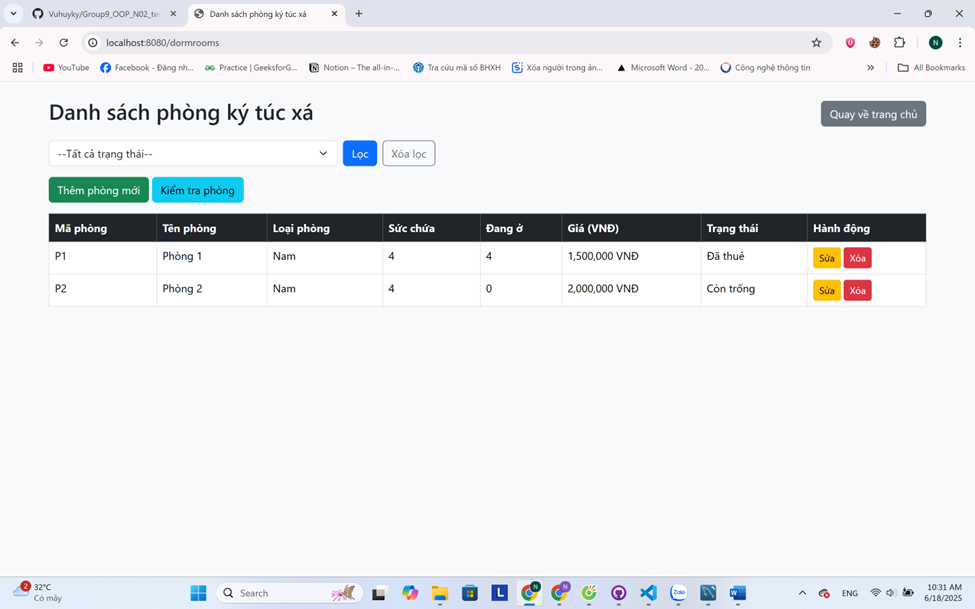
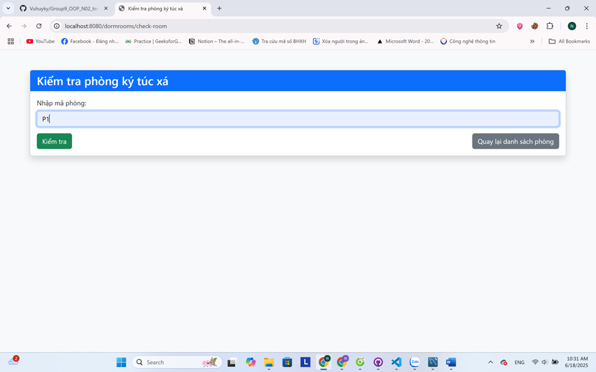
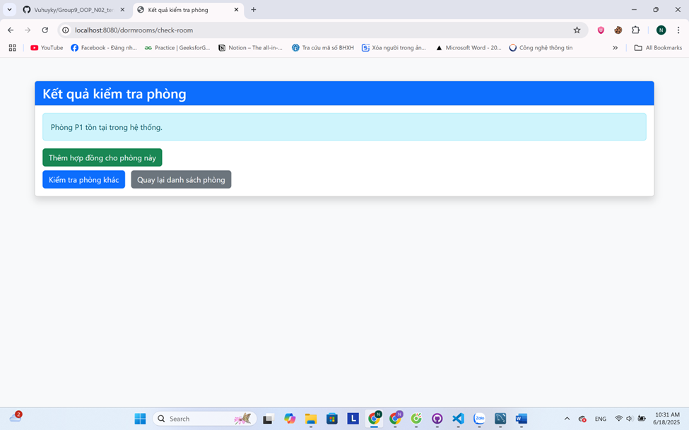
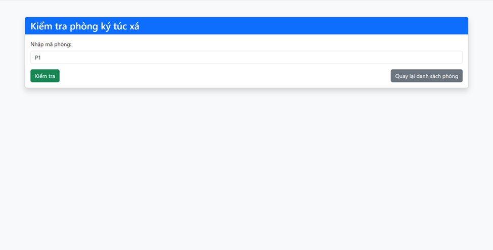
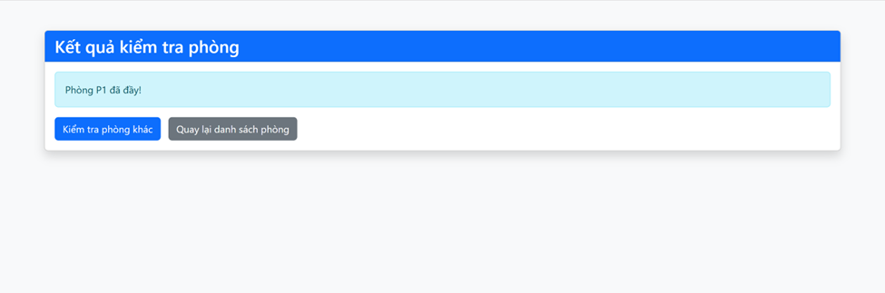
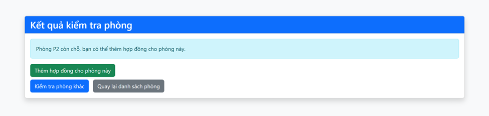
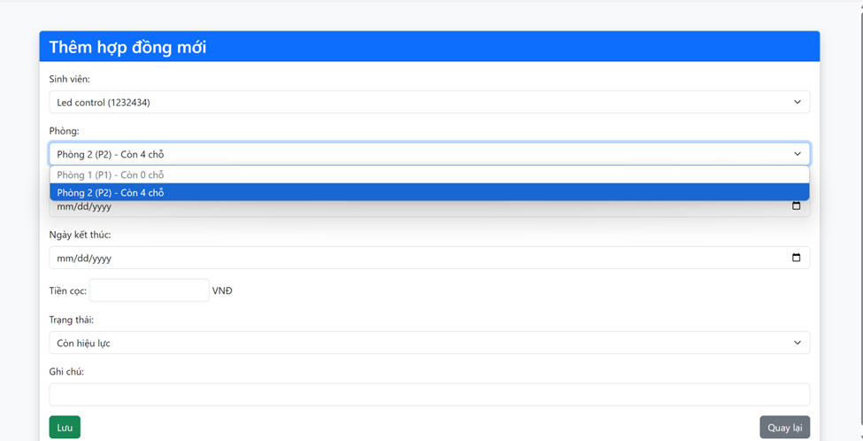

# Group9
1. Vũ Huy Kỳ 22010414 Github id: Vuhuyky
2. Đỗ Minh Nhật 22010464 Github id: MinhNhat2710

## Readme Giới thiệu
https://vuhuyky.github.io/Group9_OOP_N02_term3_2025/

Xây dựng ứng dụng quản lý ký túc xá

****Yêu cầu 2:****
## 1. Tiêu đề
**Xây dựng ứng dụng quản lý ký túc xá**

---

## 2. Phân tích đối tượng chính
- **Sinh viên (Student):**  
  Quản lý thông tin cá nhân, mã số, lớp, liên hệ, phòng ở.
- **Phòng ký túc xá (DormRoom):**  
  Quản lý mã phòng, loại phòng, số lượng tối đa, số lượng hiện tại, trạng thái phòng.
- **Hợp đồng thuê phòng (RentalContract):**  
  Quản lý mã hợp đồng, sinh viên thuê, phòng, ngày bắt đầu, ngày kết thúc, trạng thái hợp đồng.

---

## 3. Cấu trúc thư mục project
Theo code trong src ở trên

---

## 4. Các class chính

- **Student.java**
- **DormRoom.java**
- **RentalContract.java**

---

## 5. Các class kiểm định (test)

- **StudentTest.java**
- **DormRoomTest.java**
- **RentalContractTest.java**

---

**Yêu cầu 3:**

- Giao diện Java Spring Boot 

1. **Có chức năng qquản lý phòng ký túc xá**
   - Thêm, sửa, xoá phòng.
   - Liệt kê thông tin phòng.
   - Lọc phòng còn trống hoặc đã thuê.

2. **Có chức năng qquản lý sinh viên**
   - Thêm, sửa, xoá thông tin sinh viên.
   - Liệt kê sinh viên.
   - Lọc sinh viên theo lớp, khoa, trạng thái thuê phòng.

3. **Có chức năng quản lý hợp đồng thuê phòng**
   - Gán sinh viên vào phòng.
   - Kiểm tra phòng còn chỗ trống.
   - Quản lý trạng thái thuê phòng của sinh viên.

- Dữ liệu được lưu trữ xuống file nhị phân

    + Cần tạo các lớp liên quan đến Phòng ký túc xá (DormRoom), Sinh viên (Student), và Hợp đồng thuê phòng (RentalContract) để đọc, ghi xuống 1 hay nhiều file.

- Khi làm việc với dữ liệu trong bộ nhớ, dữ liệu cần được lưu trữ dưới dạng các Collection tùy chọn như ArrayList, LinkedList, Map,... để quản lý tập hợp đối tượng.

- Sinh viên có thể thêm các chức năng vào chương trình để ứng dụng phong phú hơn bằng cách thêm các nghiệp vụ nâng cao cho bài toán quản lý ký túc xá (tùy chọn).

Nội dung 02:
Sơ đồ Class Diagram

Nội dung 03:

**Sequence them phong**

**Sequence hop dong**

**Sequence gan sinh vien**

## Lưu đồ thuật toán

## Giai đoạn phát triển CRUD Java thuần (trước khi chuyển sang Spring Boot)

### 1. Thực hiện CRUD cho ít nhất 03 đối tượng

Ở phiên bản đầu tiên (Java console), nhóm đã xây dựng chức năng CRUD cho 3 đối tượng chính:
- Sinh viên (Student)
- Phòng ký túc xá (DormRoom)
- Hợp đồng thuê phòng (RentalContract)

### 2. Tái sử dụng code CRUD cho n đối tượng

Để tránh lặp lại code, nhóm đã thiết kế một class CRUD tổng quát sử dụng generic (hoặc interface chung), cho phép thực hiện các thao tác CRUD (thêm, sửa, xóa, tìm kiếm, liệt kê) cho nhiều đối tượng khác nhau chỉ với một lần cài đặt.

### 3. Kiểm thử CRUD cho n đối tượng

Nhóm đã kiểm thử các thao tác CRUD cho từng đối tượng bằng các class kiểm thử riêng biệt (ví dụ: StudentTest, DormRoomTest, RentalContractTest) để đảm bảo tính đúng đắn của các thao tác.

> **Lưu ý:**  
> Toàn bộ mã nguồn của giai đoạn này được lưu trong folder `src` cũ của repo.  
> Sau khi hoàn thiện, nhóm đã chuyển sang phát triển ứng dụng web với Spring Boot ở các giai đoạn tiếp theo.
**Phân chia:**
*Đỗ Minh Nhật* 
**Chức năng:** Kiểm tra xem phòng có tồn tại hay không.

Miêu tả công việc:

- Viết phương thức để kiểm tra sự tồn tại của phòng trong cơ sở dữ liệu.

- Phương thức này nhận ID phòng và tìm kiếm phòng trong cơ sở dữ liệu.

- Trả về thông báo nếu phòng không tồn tại.

public boolean isRoomExist(String roomId) {
    return roomRepository.existsById(roomId); // Kiểm tra sự tồn tại của phòng
}

*Vũ Huy Kỳ*
**Chức năng:** Kiểm tra phòng có đầy hay không và đăng ký sinh viên vào phòng.

Miêu tả công việc:

- Viết phương thức để kiểm tra phòng có đầy hay không (dựa vào số lượng sinh viên đã đăng ký trong phòng).

- Nếu phòng chưa đầy, tiếp tục đăng ký sinh viên vào phòng.

- Cập nhật thông tin sinh viên, ghi nhận ngày check-in và gán phòng cho sinh viên.

# Yêu cầu 7: 
Giao diện của Đỗ Minh Nhật:

Giao diện của Vũ Huy Kỳ:

